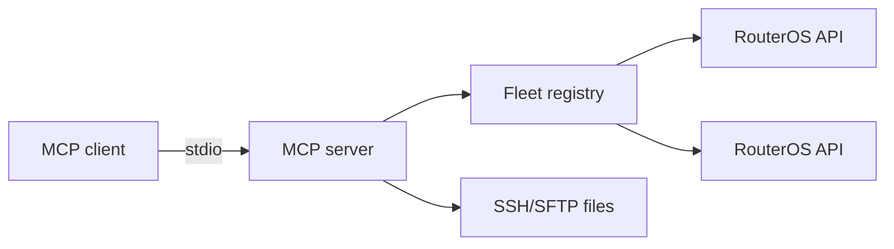

<div align="center">

# MikroTik MCP Server

**Let AI assistants manage MikroTik routers over the native RouterOS API — one static binary, any MCP client.**

[](https://github.com/Delnegend/mikrotik-mcp-server/actions) [](https://github.com/Delnegend/mikrotik-mcp-server/releases) [](LICENSE)

</div>

---

## Quick Start

```bash
# 1. Install
go install github.com/Delnegend/mikrotik-mcp@latest

# 2. Register it with your MCP client (opencode shown; 3 more in docs)
# opencode.json -> "mcp": { "mikrotik": {
#   "type": "local", "command": ["mikrotik-mcp", "192.168.88.1"],
#   "environment": { "MIKROTIK_USER": "admin", "MIKROTIK_PASSWORD": "<…>" } } }

# 3. Verify
mikrotik-mcp -version
```

Then ask your assistant to run `list_devices` — a healthy server answers with your fleet.

## Highlights

- **Full router control from chat** — interfaces, routing, DHCP, DNS, firewall, WireGuard, and more.
- **Fleet-ready** — manage many routers from one server; each call targets a device by title.
- **Safe by default** — TLS verified, SSH host keys pinned, and Safe Mode holds changes until you commit.
- **One binary, zero daemons** — speaks MCP over stdio; release archives also ship `rosbackup`.

## Common Options

```bash
mikrotik-mcp <router-host>   # hostname or IP of the router
mikrotik-mcp -version        # prints the embedded build version
```

| Option | Default | Description |
|---|---|---|
| `<router-host>` | — | Router hostname or IP (required positional arg) |
| `-version` | `false` | Print the embedded build version and exit |

Full setup, environment, and flags live in **[Client Setup](docs/client-setup.md)** and **[Configuration](docs/configuration.md)**.

## Architecture



Component boundaries and guarantees: **[Architecture](docs/architecture.md)**. All 69 tools: **[Tool Reference](docs/tool-reference.md)**.

## Documentation

- **[Client Setup](docs/client-setup.md)** — opencode, Claude Code, VS Code, Zed configs.
- **[Configuration](docs/configuration.md)** — environment variables and fleet inventory.
- **[Architecture](docs/architecture.md)** — components, safe mode, guarantees.
- **[Tool Reference](docs/tool-reference.md)** — every MCP tool by area.
- **[Backup](docs/backup.md)** — `rosbackup` CLI quick guide.
- **[Backup & restore guide](docs/BACKUP-RESTORE.md)** — full disaster-recovery walkthrough.
- **[Development](docs/DEVELOPMENT.md)** — build, test, and CHR suite.

## License

[MIT](LICENSE)
