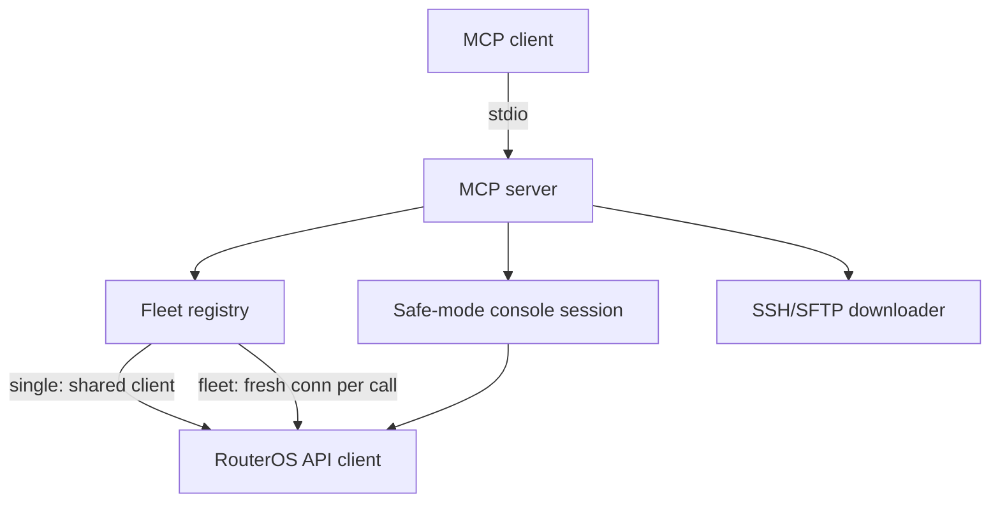

# Architecture

The server is a thin MCP adapter over the native RouterOS API: one process,
one stdio transport, one client per device, with safe mode and file transfer
as the only stateful paths.

## Core Components

- **MCP server:** registers all tools and routes each call to the target device.
- **Fleet registry:** single device from flat env, or a validated JSON inventory.
- **RouterOS API client:** lazy TLS connections with verified certs and private-CA files.
- **Safe mode:** mutating tools run through a held console session until commit or rollback.
- **File transfer:** fingerprint-pinned SFTP confined to the workspace root.
- **Healthcheck:** probes API, SCP, and passwordless readiness in one call.

## Invariants & Guarantees

- **TLS by default:** verified certs; typos in TLS switches fail startup, never downgrade.
- **SSH fails closed:** no pinned fingerprint and no explicit insecure opt-out means refusal.
- **Contained downloads:** absolute paths escaping the workspace are rejected.
- **Cancellable long runs:** `resource_listen`, `tool_ping`, `tool_traceroute` are interrupted on cancel.
- **Safe mode reverts:** uncommitted changes vanish on rollback or disconnect.

Deep contributor internals live in [Development](DEVELOPMENT.md).
